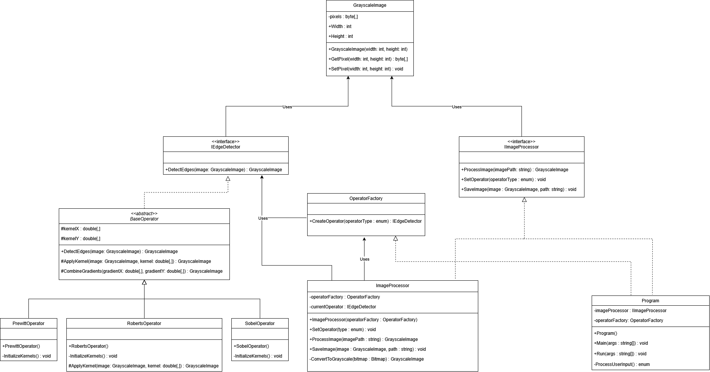

# Edge Detection Project

## Overview
This project implements edge detection algorithms in C#, featuring Sobel, Prewitt, and Roberts operators. Edge detection is a fundamental image processing technique that identifies boundaries of objects within images by detecting discontinuities in brightness.

### Supported Operators
- **Sobel Operator**: Emphasizes edges using two 3x3 kernels for horizontal and vertical edge detection, with stronger weight on central pixels
- **Prewitt Operator**: Similar to Sobel but with uniform weights, making it more sensitive to noise but potentially better at detecting diagonal edges
- **Roberts Operator**: Uses 2x2 kernels for fast computation, best suited for sharp edges and high-contrast images

## Requirements
- **.NET 8.0** or higher
  - [Download .NET Framework 8.0 SDK](https://dotnet.microsoft.com/en-us/download/dotnet/8.0)
- **Windows OS** (Required for System.Drawing dependencies)


## Installation & Setup

1. **Clone the repository:**
   ```sh
   git clone https://github.com/steefpls/EdgeDetection.git
   cd EdgeDetection
   ```

2. **Build the application:**
   ```sh
   dotnet build
   ```

3. **Run the tests:**
   ```sh
   dotnet test
   ```

## Usage

1. **Prepare your image:**
   - Place your input image in this folder (```EdgeDetection.ConsoleApp\bin\Debug\net8.0```)
   - Supported formats: JPG, PNG
   - Images are automatically converted to grayscale during processing

2. **Run the application:**
   ```sh
   dotnet run --project EdgeDetection.ConsoleApp <input_image> <output_image>
   ```
   Example:
   ```sh
   dotnet run --project EdgeDetection.ConsoleApp input.jpg output.png
   ```

3. **Select operator:**
   - When prompted, choose:
     1: Sobel operator
     2: Prewitt operator
     3: Roberts operator

## Architecture

The project follows SOLID principles and clean architecture:

- **Core Components:**
  - `GrayscaleImage`: Handles image data in grayscale format
  - `BaseOperator`: Abstract class implementing common edge detection logic
  - `IEdgeDetector`: Interface for edge detection operators
  - `IImageProcessor`: Interface for image processing operations

- **Operators:**
  - Each operator (Sobel, Prewitt, Roberts) extends BaseOperator
  - Implements specific kernel matrices for edge detection
  - Factory pattern used for operator instantiation

- **Processing Pipeline:**
  1. Image loading and grayscale conversion
  2. Operator selection and initialization
  3. Edge detection processing
  4. Result saving

## Testing

The project includes comprehensive unit tests covering:
- Operator functionality
- Image processing pipeline
- Edge cases and error handling
- Input validation

Test coverage includes:
- All edge detection operators
- Image processing workflows
- Factory class functionality
- Grayscale image operations

## Known Limitations

1. **Image Size:**
   - Very large images may require significant memory
   - Border pixels are not processed

2. **Platform:**
   - Windows-only due to System.Drawing dependencies
   - No Linux/macOS support currently

3. **Performance:**
   - Single-threaded processing
   - No GPU acceleration

## Troubleshooting

Common issues and solutions:

1. **FileNotFoundException:**
   - Ensure input file exists in the correct directory
   - Check file permissions

2. **OutOfMemoryException:**
   - Try processing a smaller image
   - Ensure sufficient system memory


## UML Diagram
[](docs/UML_Diagram.png)
